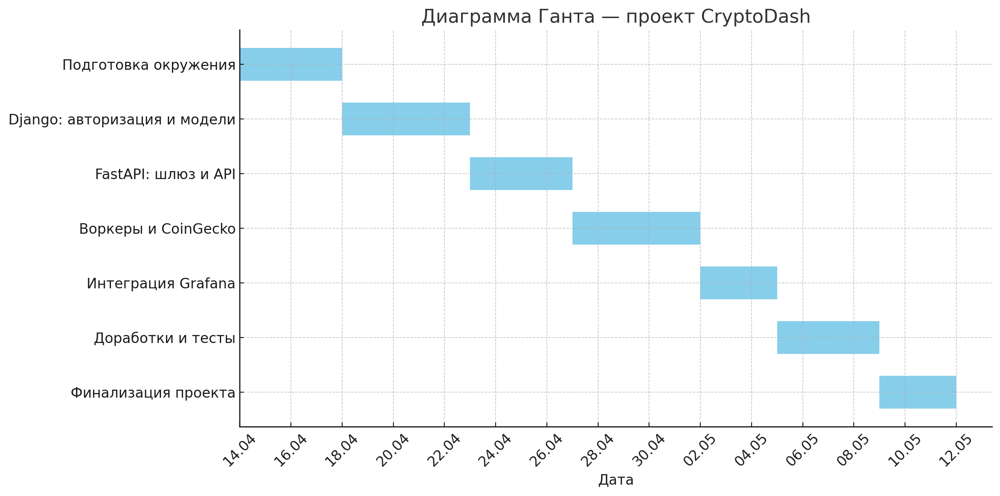

# 🗓️ План реализации проекта CryptoDash

**Старт:** 14.04.2025  
**Формат:** 1 разработчик, занятость — вечерами + выходные  
**Цель:** MVP (минимально работающая версия) с красивой архитектурой, API и Grafana-дашбордом

---

## 🔹 Этап 1 — Подготовка окружения и репозитория
**Срок:** 14.04–17.04 (4 дня)
- Инициализация проекта (GitHub)
- Базовая структура monorepo
- Docker Compose:
  - Redis
  - RabbitMQ
  - ClickHouse
  - PostgreSQL (для Django)
  - Grafana
- Заглушки для Django, FastAPI, worker

✅ _Результат:_ `docker-compose up` запускает всё, что нужно

---

## 🔹 Этап 2 — Django: Авторизация и модели
**Срок:** 18.04–22.04 (5 дней, включая выходные)
- Настройка Django + PostgreSQL
- Регистрация / логин / токены
- Модели пользователей и подписок на криптовалюты
- Django админка

✅ _Результат:_ можно создать пользователей и привязать монеты

---

## 🔹 Этап 3 — FastAPI-сервис
**Срок:** 23.04–26.04 (4 дня)
- Подключение FastAPI и базовый роутинг
- JWT авторизация
- Эндпоинты:
  - `/prices`
  - `/history`
  - `/track`
- Swagger и Postman-тесты

✅ _Результат:_ можно получать данные по крипте и управлять подписками

---

## 🔹 Этап 4 — Воркеры и интеграция CoinGecko
**Срок:** 27.04–01.05 (5 дней)
- Celery + RabbitMQ
- Redis как кэш
- Получение цен с CoinGecko
- Запись в ClickHouse и Redis

✅ _Результат:_ система получает реальные данные и пишет их

---

## 🔹 Этап 5 — Интеграция Grafana
**Срок:** 02.05–04.05 (3 дня)
- Подключение Grafana к ClickHouse
- Создание дашборда
- Встраивание iframe или портальный доступ

✅ _Результат:_ визуализация истории цен

---

## 🔹 Этап 6 — Доработки и тесты
**Срок:** 05.05–08.05 (4 дня)
- Обработка ошибок
- Примеры Postman-запросов
- Юнит-тесты

✅ _Результат:_ готовый, стабильно работающий MVP

---

## 🔹 Этап 7 — Буфер и оформление
**Срок:** 09.05–11.05 (3 дня)
- README.md
- Makefile, миграции
- Комментарии, cleanup

---

## 📅 Итоговый график:

| Этап                 | Срок         |
|----------------------|--------------|
| Подготовка           | 14.04–17.04  |
| Django               | 18.04–22.04  |
| FastAPI              | 23.04–26.04  |
| Воркеры              | 27.04–01.05  |
| Grafana              | 02.05–04.05  |
| Доработки и тесты    | 05.05–08.05  |
| Финализация проекта  | 09.05–11.05  |

✅ **Ожидаемая дата готовности MVP: 11.05.2025**

---

## Диаграмма Ганта

